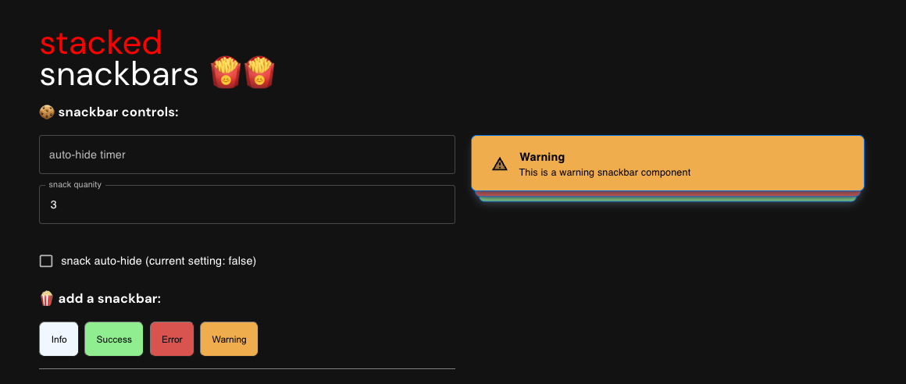

# Stacked SnackBars - Malcolm Peterson

## Objective

- **Stack:** You can use Base UI's [`UnstyledSnackbar`](https://mui.com/base/react-snackbar/) component or another headless component library as the foundation for it.
- **Interactivity:**
  - The other Snackbar instances should be visible after some interaction, either clicking a button or hovering the stack.
  - They should be kept open if the focus is inside them. Conversely, they should collapse as the focus moves out of it.
  - There should be the possibility to close them by clicking on a close button.
  - _Bonus:_ adding an option for it to be closed after some configurable time interval. It should still be compatible with [WCAG 2.2.1](https://www.w3.org/TR/WCAG21/#enough-time).
- **Transitions:** the Snackbars should appear and disappear gracefully on the screen, using an animation.
- **Dark mode:** make sure to support light and dark modes.

----

## Functionality
- When an event is triggered (in this case, a button press), a Snackbar will be displayed based upon what has happened.
- When Snackbar stack is hovered the stack will 'flair' out to invite the user to interact with it. 
- The stack will expand when the user clicks or tabs over on of the individual Snackbar components.
- Once expanded the 'Show Less' button will appear and if clicked will collapse the snackbar and then disappear from the viewport.
- Animations will play whenever any changes happen to the stack

## Customization
- Snackbars have a default style that are compatible with light and dark modes but users can supply their own styling if they wish (as demonstrated with the success, error and warning buttons). 
- Auto-hide timer can be modified by passing a value into the `autohideDuration` prop that is fed into the Snackbars component. This feature can be disabled by passing `false` into the autoHide prop.
- By default the stack will collapse on its own when it is not focused or hovered. This interval of time is hardcoded to be half of the value of the auto-hide timer.
- The amount of Snackbars on screen can be limited as well by passing a value into the `snackbarMax` prop.

## Future Considerations
- Due to the timed nature of this challenge, I prioritzed Snackbar functionality and working out the animations. However, there were things I wanted to include:
  - I read that using input type = 'number' could cause issue but in this use case I thought it would be ok.
  - Making the page fully responsive.
  - I would have also worked to add more accessiblity functions to this component. As now you cannot close the snackbars without a mouse.
  - With the customization options available I would have also added a `position` prop to signal where the component would sit on the screen. 
  - More tweaks to the animations. 

## Resources
- I referenced a few resources while building this out so I wanted to leave them here in case they will provide more insight.
  - [GitHub Discussion about implementing similar feature](https://github.com/mui/material-ui/issues/1824)
  - [Third party library suggest by MUI to do similar functionality](https://notistack.com/)
  - [CSS Tricks article about how to make animations more natural](https://css-tricks.com/making-css-animations-feel-natural/#:~:text=An%20easy%20fix%20is%20to,natural%20look%20to%20some%20animations)
  - [Medium post about making toast/snackbars more accessible](https://sheribyrnehaber.medium.com/designing-toast-messages-for-accessibility-fb610ac364be)

## Work environment

- clone the repo: `git clone git@github.com:mui/tech-challenge-design-engineer.git`
- install the dependencies: `yarn`
- start Next.js: `yarn dev`
- open http://0.0.0.0:3002/
